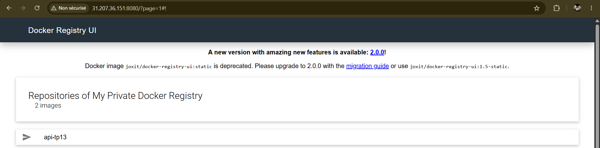
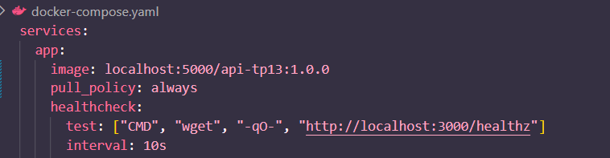
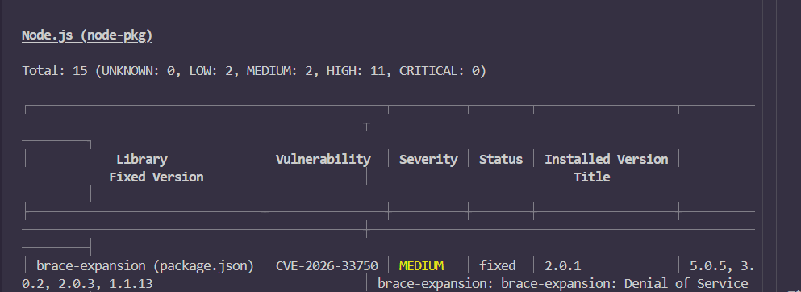
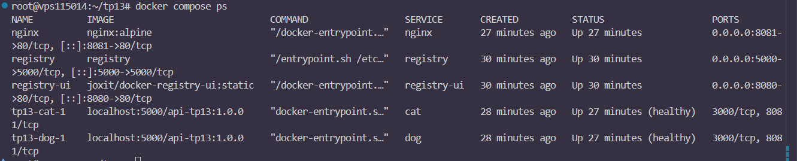
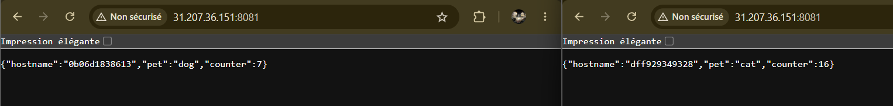
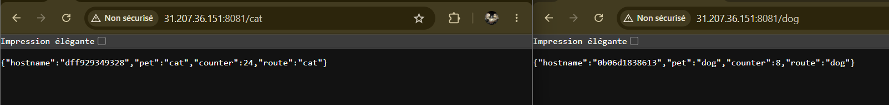

Ethan DAHI GERMAIN

# Partie 1 — API & Dockerfile

# Partie 2 — Registry privé

## Interface  

## Docker compose  

# Partie 3 — Stack Compose & Nginx

# Partie 4 - Sécurité

### Pourquoi node:20-alpine plutôt que node:latest ? Quel est l'impact sur le nombre de CVE ?

J'ai choisis node:20-alpine à la place de node:latest car c'est une version stable (fix) et qu'elle est environ 90% plus légère. Et cela réduit donc mécaniquement drastiquement le nombre de CVE car la surface est beaucoup plus petite.

# Partie 5 - Validation de la stack

# Partie 6 - Question théoriques

### Question Swarm

Docker compose up permet de lancer plusieurs container sur une machine alors que docker stack deploy permet de deployer une stack sur plusieurs machines. Build n'est pas utilisable car dans un cluster les noeuds récupere juste une image prète à l'emploie, pas de fichier source donc pas de build, celui ci est fait postérieurement.

### Question Secrets

Un mot de passe par variable d'environnemnt est accéssible au seins du container, elle peut appparaitre dans des logs ou en faisant docker inspect. Alors qu'un secret docker est chiffré et n'apparait pas dans docker inspect, ce secret est accéssible à /run/secrets/<nom_du_secret>. Il est possible de le lire comme cela : 

const fs = require('fs');

const password = fs
  .readFileSync('/run/secrets/db_password', 'utf8')
  .trim();

console.log(password);

### Question Backup 

Les elements qui sont recréable automatiquement sont les images (via Dockerfile ou registry), les containers(via docker compose up) et les reseaux(via docker compose up). Et ce qui ne l'est pas sont les volumes par exemple, notamment pour les bases de données. Il est donc important d'en faire régulirement des dump.

# Partie 7 - Observabilité & Production

